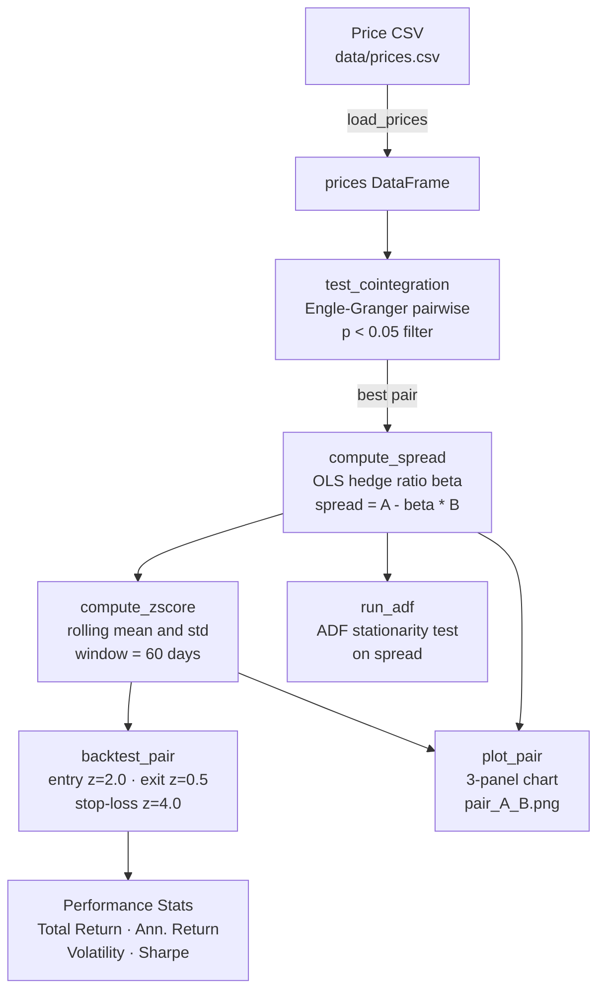

# Statistical Arbitrage Trader

A pairs trading strategy backtester built on cointegration analysis and Z-score-based entry/exit signals. It tests all asset combinations for cointegration, computes OLS hedge ratios, and backtests a mean-reversion strategy on the most significantly cointegrated pair.

---

## Features

- **`PairsConfig` dataclass** — single configuration object for all strategy parameters
- **`test_cointegration()`** — pairwise Engle-Granger cointegration test across all asset combinations, filtered at p < 0.05
- **`compute_spread()`** — OLS hedge ratio estimation and spread construction (`spread = A - beta * B`)
- **`compute_zscore()`** — rolling Z-score normalisation of the spread
- **`backtest_pair()`** — event-driven backtest loop with Z-score entry, exit, and stop-loss logic
- **`run_adf()`** — Augmented Dickey-Fuller stationarity test on the spread
- **`plot_pair()`** — three-panel chart showing price series, spread, and Z-score with signal thresholds
- **Synthetic data fallback** — generates a known cointegrated pair (A, B) and an unrelated asset (C) when no CSV is present

---

## `PairsConfig` Defaults

```python
@dataclass
class PairsConfig:
    lookback_window: int = 60       # days for rolling spread mean/std
    entry_z: float = 2.0            # Z-score to open a position
    exit_z: float = 0.5             # Z-score to close a position
    stop_loss_z: float = 4.0        # Z-score stop-loss
    transaction_cost_bps: float = 5.0
```

---

## How It Works

### Cointegration Testing — `test_cointegration(prices, p_threshold=0.05)`

Uses `statsmodels.tsa.stattools.coint` (Engle-Granger two-step method) to test every unique pair of assets from `itertools.combinations`. Only pairs with a p-value below `p_threshold` are retained. Results are returned as a list of `(asset_a, asset_b, p_value)` tuples sorted by ascending p-value, so the most strongly cointegrated pair comes first.

### OLS Hedge Ratio — `compute_spread(series_a, series_b)`

Fits an OLS regression of asset A on asset B (with a constant) using `statsmodels`:

```
A = alpha + beta * B + epsilon
spread = A - beta * B
```

Returns the spread series and the estimated `beta`. This hedge ratio keeps the spread approximately dollar-neutral.

### Z-Score — `compute_zscore(spread, window)`

Normalises the spread using a rolling window of `lookback_window` days:

```
z = (spread - rolling_mean) / rolling_std
```

### Entry / Exit / Stop-Loss Logic — `backtest_pair()`

The strategy holds a single unit at a time (`position` is -1, 0, or +1):

| State | Condition | Action |
|-------|-----------|--------|
| Flat | `z < -entry_z` (z < -2.0) | Enter long A / short B (position = +1) |
| Flat | `z > +entry_z` (z > +2.0) | Enter short A / long B (position = -1) |
| Long (+1) | `z > -exit_z` (z > -0.5) | Close position |
| Long (+1) | `z > +stop_loss_z` (z > +4.0) | Close position (stop-loss) |
| Short (-1) | `z < +exit_z` (z < +0.5) | Close position |
| Short (-1) | `z < -stop_loss_z` (z < -4.0) | Close position (stop-loss) |

Daily PnL for a held position:

```
pnl = position * (ret_A - beta * ret_B)
```

Transaction costs of `transaction_cost_bps / 10000` are deducted whenever `position` changes.

### ADF Test — `run_adf(spread)`

Runs `statsmodels.tsa.stattools.adfuller` on the spread (after dropping NaNs) and returns:

```python
{"ADF Statistic": float, "p-value": float}
```

A low p-value (typically < 0.05) confirms the spread is stationary, validating the pairs trade.

### `plot_pair()` — Three-Panel Chart

Produces a 12 x 10-inch figure with three vertically stacked, time-aligned panels and saves it to `pair_ASSET_A_ASSET_B.png` at 150 dpi:

| Panel | Content | Colour |
|-------|---------|--------|
| Top | Raw price series for both assets on the same axis | Default |
| Middle | OLS spread (`A - beta * B`) | Purple |
| Bottom | Rolling Z-score with dashed horizontal lines at `+/-entry_z` and `+/-exit_z` | Teal |

---

## Tech Stack

| Library | Version | Purpose |
|---------|---------|---------|
| pandas | >= 2.0 | Time-indexed price data and return series |
| numpy | >= 1.24 | Numerical operations, synthetic price generation |
| statsmodels | >= 0.14 | `coint`, `adfuller`, `OLS` regression |
| matplotlib | >= 3.7 | Three-panel pair analysis chart |

---

## Setup

```bash
pip install -r requirements.txt
```

Optionally place your price data at `data/prices.csv` with a date index and one column per asset. If absent the script uses built-in synthetic cointegrated data.

```bash
python pairs_trader.py
```

---

## Architecture



---

## Usage Example

```python
from pairs_trader import (
    PairsConfig, load_prices, test_cointegration,
    backtest_pair, compute_spread, run_adf, plot_pair
)

cfg = PairsConfig(entry_z=2.0, exit_z=0.5, stop_loss_z=4.0)
prices = load_prices("data/prices.csv")

pairs = test_cointegration(prices)
best_a, best_b, pval = pairs[0]
print(f"Best pair: {best_a}/{best_b}  p={pval:.4f}")

returns = backtest_pair(prices, best_a, best_b, cfg)

spread, beta = compute_spread(prices[best_a], prices[best_b])
adf = run_adf(spread)
print(f"ADF p-value: {adf['p-value']:.4f}")

plot_pair(prices, best_a, best_b, cfg)
```

Running `python pairs_trader.py` directly prints:

```
Testing for cointegrated pairs...
Found 1 cointegrated pair(s):
  ASSET_A / ASSET_B  (p=0.0001)

Backtest: ASSET_A/ASSET_B
  Total Return : x.xx%
  Ann. Return  : x.xx%
  Volatility   : x.xx%
  Sharpe Ratio : x.xx
  ADF p-value  : 0.0001
Saved pair_ASSET_A_ASSET_B.png
```

---

## Screenshots

| Pairs Analysis Chart |
|---|
| *(run `python pairs_trader.py` to generate `pair_ASSET_A_ASSET_B.png`)* |

---

## Author

**Ram Sidhartha**
