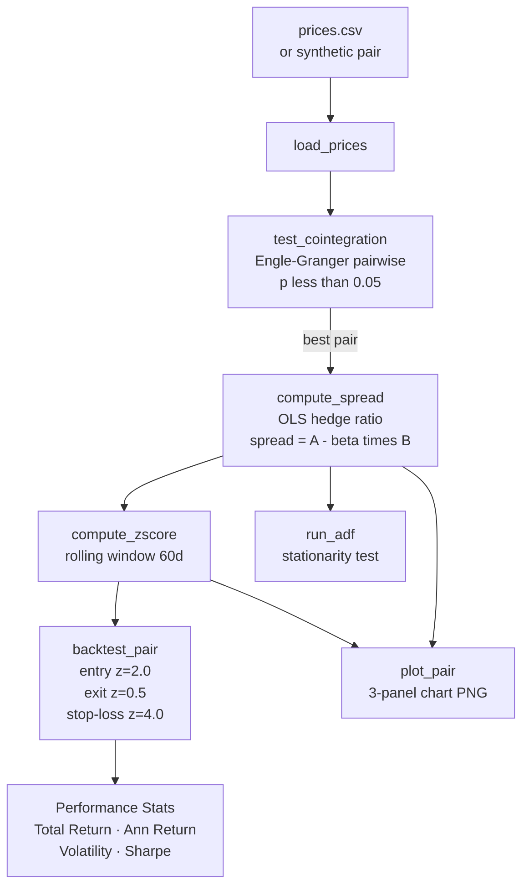

# Statistical Arbitrage Trader

A pairs trading backtester built on cointegration analysis and Z-score mean-reversion signals. It scans all asset combinations for statistically significant cointegration, estimates OLS hedge ratios for the best pairs, and backtests a long/short strategy with configurable entry, exit, and stop-loss Z-score thresholds.

The core idea is that two cointegrated assets share a long-run equilibrium relationship. When their spread deviates far enough from its rolling mean (Z-score > entry threshold), you take the trade expecting the spread to revert. You close when it comes back in (Z-score < exit threshold) or hit a stop-loss if it keeps going the wrong way. The hedge ratio from OLS regression keeps the trade approximately dollar-neutral on each side.

No real price data needed — the script generates a synthetic cointegrated pair (ASSET_A and ASSET_B with B = 1.5*A + noise) and an unrelated asset (ASSET_C) so you can see the full pipeline run immediately.

## Features

- **`test_cointegration()`** — runs Engle-Granger pairwise tests across all combinations using `statsmodels.tsa.stattools.coint`; returns pairs sorted by ascending p-value at `p < 0.05`
- **`compute_spread()`** — OLS regression of A on B via `statsmodels.regression.linear_model.OLS`; returns `spread = A - beta * B` and the hedge ratio `beta`
- **`compute_zscore()`** — rolling Z-score normalisation over a configurable `lookback_window`: `(spread - rolling_mean) / rolling_std`
- **`backtest_pair()`** — event-driven loop with three position states (+1 long A/short B, -1 short A/long B, 0 flat); entry at `|z| > 2.0`, exit at `|z| < 0.5`, stop-loss at `|z| > 4.0`; transaction costs deducted on position changes
- **`run_adf()`** — Augmented Dickey-Fuller stationarity test on the spread to validate mean-reversion assumption; reports ADF statistic and p-value
- **`plot_pair()`** — three-panel 12×10 matplotlib figure: price series, OLS spread, and rolling Z-score with dashed signal threshold lines; saved as `pair_A_B.png`
- **`PairsConfig` dataclass** — all strategy parameters in one place: `lookback_window`, `entry_z`, `exit_z`, `stop_loss_z`, `transaction_cost_bps`
- **Synthetic cointegrated data** — `_synthetic_cointegrated_prices()` generates a known pair (B = 1.5*A + noise) for testing; uses `numpy.random.default_rng(7)` for reproducibility

## Tech Stack

| Library | Purpose |
|---|---|
| `pandas` | Date-indexed price data and return series |
| `numpy` | Numerical operations, synthetic price generation |
| `statsmodels` | `coint`, `adfuller`, OLS regression |
| `matplotlib` | Three-panel pair analysis chart |

## Setup

```bash
git clone https://github.com/isidhartha/statistical-arbitrage-trader.git
cd statistical-arbitrage-trader
pip install -r requirements.txt
```

Optionally place price data at `data/prices.csv` with a date index and one column per asset. Without it the script uses synthetic data.

```bash
python pairs_trader.py
```

**As a library:**

```python
from pairs_trader import PairsConfig, load_prices, test_cointegration, backtest_pair, run_adf, plot_pair

cfg = PairsConfig(entry_z=2.0, exit_z=0.5, stop_loss_z=4.0)
prices = load_prices("data/prices.csv")

pairs = test_cointegration(prices)
best_a, best_b, pval = pairs[0]

returns = backtest_pair(prices, best_a, best_b, cfg)
plot_pair(prices, best_a, best_b, cfg)
```

## Architecture



**Default strategy parameters:**

```
lookback_window     : 60   days (rolling spread Z-score)
entry_z             : 2.0  standard deviations
exit_z              : 0.5  standard deviations
stop_loss_z         : 4.0  standard deviations
transaction_cost    : 5.0  bps per leg per trade
```

## Demo

> Run `python pairs_trader.py` to generate `pair_ASSET_A_ASSET_B.png`. Screenshot coming soon.

## Contributing

See [CONTRIBUTING.md](CONTRIBUTING.md) for guidelines.

## License

MIT

## Author

[isidhartha](https://github.com/isidhartha)
