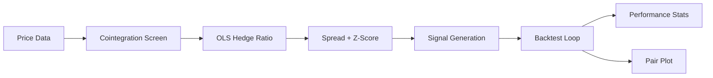

# Statistical Arbitrage Trader

A pairs trading strategy backtester that identifies cointegrated asset pairs using the Engle-Granger test, estimates dynamic hedge ratios via OLS regression, and trades Z-score mean-reversion signals with configurable entry/exit/stop-loss thresholds.

## Features

- Engle-Granger cointegration screening across all asset pairs
- OLS hedge ratio estimation (spread = A − β·B)
- Rolling Z-score signal with configurable windows
- Entry, exit, and stop-loss Z-score thresholds
- Transaction cost modelling per trade leg
- ADF stationarity test on the spread
- Pair visualisation: price series, spread, and Z-score subplots
- Synthetic cointegrated data for demo/CI

## Tech Stack

| Layer | Technology |
|-------|-----------|
| Statistics | statsmodels (OLS, ADF, Engle-Granger) |
| Data | Pandas, NumPy |
| Visualisation | Matplotlib |
| Runtime | Python 3.11+ |

## Setup

```bash
git clone https://github.com/ramsidhartha/statistical-arbitrage-trader
cd statistical-arbitrage-trader
pip install -r requirements.txt

# Run with synthetic data
python pairs_trader.py

# With your own data: place wide-format CSV at data/prices.csv
# Columns: date (index), ASSET_A, ASSET_B, ...
python pairs_trader.py
```

## Architecture



## Configuration (PairsConfig)

| Parameter | Default | Description |
|-----------|---------|-------------|
| `lookback_window` | 60 | Rolling window for Z-score |
| `entry_z` | 2.0 | Z-score to open position |
| `exit_z` | 0.5 | Z-score to close position |
| `stop_loss_z` | 4.0 | Z-score stop-loss |
| `transaction_cost_bps` | 5.0 | Cost per leg (bps) |

## Screenshots

> 📸 Screenshots coming soon

## Author

Ram Sidhartha
